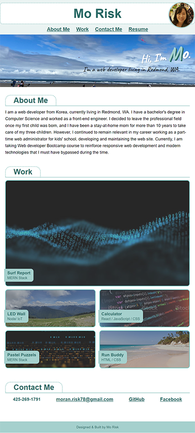
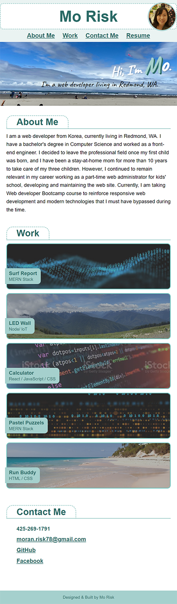

# Portfolio

## Description

This webpage is created to make a portfolio of my work in the future to showcase my skills to employers. This page is developed applying flexbox and media queries for responsive layout, and used CSS variables so that I can easily change the color scheme in the future. Since I don't have enough showcase applicaions yet, I used placehoder images, titles, and temporary links.

## Usage

- The URL of the Deployed page:  
https://morisky78.github.io/Portfolio/

- The URL of the GitHub repository:  
https://github.com/morisky78/Portfolio

The screenshots of the page is attached below to show the layout difference in 3 different screen sizes.

## Credits
For deeper understanding, I researched related topics and referred to following articles.

- Transition for image change when hovered (filters)  
https://www.w3schools.com/css/css3_transitions.asp

- A property for image to resize image to fit the container  
https://www.w3schools.com/css/css3_object-fit.asp

- Box shadow  
https://developer.mozilla.org/en-US/docs/Web/CSS/box-shadow  

- For the H1 header profile image animation  
https://developer.mozilla.org/en-US/docs/Web/CSS/CSS_Animations/Using_CSS_animations

## License
N/A

